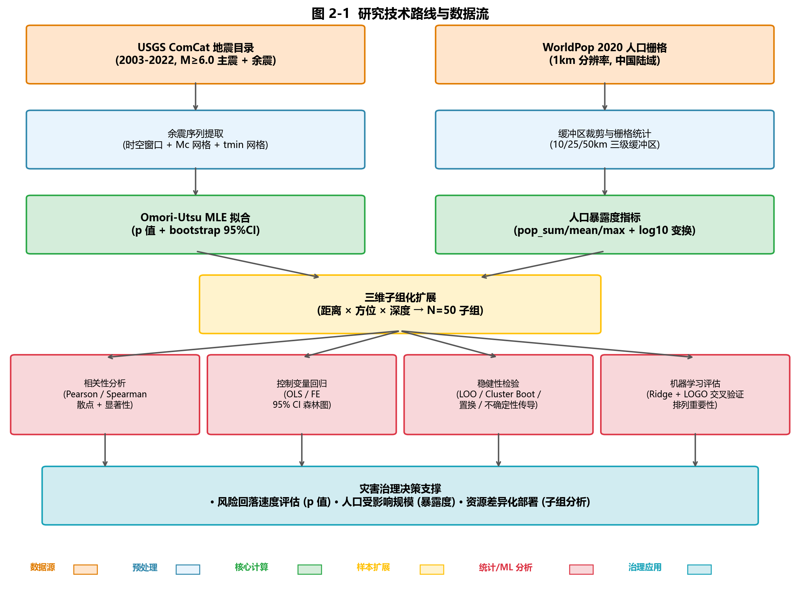

# Multi-Scale Association Between Aftershock Decay and Population Exposure in Sichuan-Yunnan

This repository contains a reproducible study for the disaster-governance and big-data domain. It estimates the Omori-Utsu decay parameter `p` for mainshock sequences in Sichuan-Yunnan from the USGS earthquake catalog, calculates population exposure within 10, 25, and 50 km using a population raster, and evaluates association robustness using fixed-effects regression, within-group permutation tests, uncertainty propagation, and Leave-One-Group-Out (LOGO) validation.

## Key Findings

- At the mainshock level, 50 km population exposure is positively correlated with `p`; however, the sample contains only eight mainshocks, so the statistical evidence is limited and does not support causal interpretation.
- In the subgroup fixed-effects model, the population-exposure coefficient is negative. The mainshock-clustered bootstrap interval and within-mainshock permutation test support this association within the observed sample.
- After propagating uncertainty in the estimated Omori parameters, the coefficient remains negative, although the result is still sensitive to the number of mainshocks, catalog completeness, and spatial scale.
- LOGO Ridge outperforms the training-mean baseline, but the dataset is too small to justify complex models or deployment-level predictive claims.

The full reasoning, formulas, figure interpretations, and limitations are provided in the [research report](docs/report.pdf) (Chinese).

## Workflow

1. Download mainshock and aftershock catalogs from USGS ComCat.
2. Clean the catalog and filter it by the magnitude-of-completeness threshold `Mc` and start time `tmin`.
3. Estimate Omori-Utsu parameters using point-process maximum likelihood and bootstrap resampling.
4. Calculate population exposure for buffers, distance rings, directional groups, and adaptive depth subgroups.
5. Run correlation analysis, mainshock fixed-effects regression, within-group permutation tests, uncertainty propagation, and mainshock influence analysis.
6. Evaluate the training-mean baseline, OLS, and Ridge using Leave-One-Mainshock-Out LOGO validation.



## Repository Layout

```text
.
├── 01_download_usgs.py ... 20_exposure_population.py  # Data acquisition and exposure
├── 03_fit_omori.py                                    # Omori fitting and adaptive subgroups
├── 31_robustness.py ... 37_mainshock_influence.py     # Statistical robustness analyses
├── 40_ml_groupkfold.py                                # LOGO predictive evaluation
├── analysis_core.py / omori_fit.py                    # Core analysis functions
├── tests/                                             # Unit and consistency tests
├── out/                                               # Selected results and figures
└── docs/report.pdf                                    # Full Chinese report
```

## Setup and Reproduction

Python 3.11 is recommended:

```powershell
python -m venv .venv
.venv\Scripts\Activate.ps1
pip install -r requirements.txt
```

The population raster is not distributed with this repository. Download a suitably licensed population GeoTIFF and set its path through an environment variable:

```powershell
$env:POP_RASTER_PATH = "D:\data\population.tif"
```

Typical execution order:

```powershell
python 10_batch_mainshocks.py
python 11_batch_download.py
python 12_batch_build_catalog.py
python 03_fit_omori.py
python 20_exposure_population.py
python 30_join_and_plot.py
python 31_robustness.py
python 32_uncertainty_propagation.py
python 34_within_mainshock_permutation.py
python 35_scale_sensitivity.py
python 37_mainshock_influence.py
python 40_ml_groupkfold.py
```

Run the tests with:

```powershell
python -m unittest discover -s tests -v
```

## Data and Release Notes

- Raw USGS event catalogs, the population raster, download caches, videos, and local QA artifacts are not included.
- `config.py` contains no machine-specific path; the population raster is supplied through the `POP_RASTER_PATH` environment variable.
- `out/` contains only derived summaries, bootstrap samples, and figures needed to support the report. Earthquake event IDs are public scientific identifiers rather than personal identifiers.

## Data Sources

- Earthquake catalog: [USGS Earthquake Catalog](https://earthquake.usgs.gov/earthquakes/search/)
- Population data: WorldPop or an equivalently licensed population raster. Users must download the data separately and comply with its license and citation requirements.

## Scope and Limitations

This is an exploratory course research project. The number of mainshocks is small, subgroups are not fully independent, and population exposure is not a direct cause of earthquake physics. The repository demonstrates a reproducible data-fusion and robustness-analysis workflow; it is not intended for disaster prediction, risk pricing, or operational emergency decision-making.

---

# 川滇地区余震衰减参数与人口暴露度的多尺度关联分析

本仓库包含一项面向“大数据与灾害治理”场景的可复现实验：使用 USGS 地震目录估计川滇地区主震序列的 Omori-Utsu 衰减参数 `p`，结合人口栅格计算 10、25、50 km 多尺度人口暴露度，并通过固定效应回归、组内置换检验、不确定性传播和 Leave-One-Group-Out（LOGO）评估检验关联的稳健性。

## 主要结论

- 主震级 50 km 暴露度与 `p` 呈正相关，但样本仅包含 8 次主震，统计证据有限，不能作因果解释。
- 子组固定效应模型中，人口暴露度系数为负；按主震聚类的 bootstrap 区间和组内置换检验支持该样本内关联。
- 传播 Omori 参数估计误差后，系数方向保持为负，但结果仍受主震数量、目录完整性和空间尺度影响。
- LOGO Ridge 优于训练集均值基线，但样本规模不足以支持复杂模型或部署级预测结论。

完整论证、公式、图表解释和局限见 [研究报告](docs/report.pdf)。

## 方法流程

1. 从 USGS ComCat 下载主震及余震目录。
2. 清洗目录并按震级完整性阈值 `Mc` 与起始时间 `tmin` 筛选。
3. 使用点过程极大似然估计 Omori-Utsu 参数，并进行 bootstrap。
4. 基于人口栅格计算缓冲区、距离环、方向与自适应深度子组暴露度。
5. 运行相关分析、主震固定效应回归、组内置换、不确定性传播和主震影响分析。
6. 使用 Leave-One-Mainshock-Out 的 LOGO 方案评估均值基线、OLS 与 Ridge。


## 仓库结构

```text
.
├── 01_download_usgs.py ... 20_exposure_population.py  # 数据获取与暴露度计算
├── 03_fit_omori.py                                  # Omori 拟合和自适应子组
├── 31_robustness.py ... 37_mainshock_influence.py    # 统计稳健性分析
├── 40_ml_groupkfold.py                              # LOGO 预测评估
├── analysis_core.py / omori_fit.py                  # 核心函数
├── tests/                                           # 单元与一致性测试
├── out/                                             # 精选汇总表、JSON 和结果图
└── docs/report.pdf                                  # 中文完整报告
```

## 环境与复现

建议使用 Python 3.11：

```powershell
python -m venv .venv
.venv\Scripts\Activate.ps1
pip install -r requirements.txt
```

人口栅格不随仓库发布。下载具有适当许可的人口 GeoTIFF 后设置环境变量：

```powershell
$env:POP_RASTER_PATH = "D:\data\population.tif"
```

典型运行顺序：

```powershell
python 10_batch_mainshocks.py
python 11_batch_download.py
python 12_batch_build_catalog.py
python 03_fit_omori.py
python 20_exposure_population.py
python 30_join_and_plot.py
python 31_robustness.py
python 32_uncertainty_propagation.py
python 34_within_mainshock_permutation.py
python 35_scale_sensitivity.py
python 37_mainshock_influence.py
python 40_ml_groupkfold.py
```

运行测试：

```powershell
python -m unittest discover -s tests -v
```

## 数据与脱敏说明

- 原始 USGS 事件目录、人口栅格、下载缓存、交互视频和本机 QA 文件未提交。
- `config.py` 不含本机路径，人口栅格位置通过 `POP_RASTER_PATH` 环境变量传入。
- `out/` 仅保留支撑报告结论的派生汇总、bootstrap 抽样和图件；地震事件 ID 是公开科学标识，不是个人标识。

## 数据来源

- 地震目录：[USGS Earthquake Catalog](https://earthquake.usgs.gov/earthquakes/search/)
- 人口数据：WorldPop 或同等许可的人口栅格。使用者需自行下载，并遵守对应数据许可与引用要求。

## 研究边界

本项目是探索性课程研究。主震数量少、子组并非完全独立，且人口暴露度不是地震物理过程的直接致因。结果用于展示可复现的数据融合与稳健性分析流程，不构成灾害预测、风险定价或应急决策依据。
